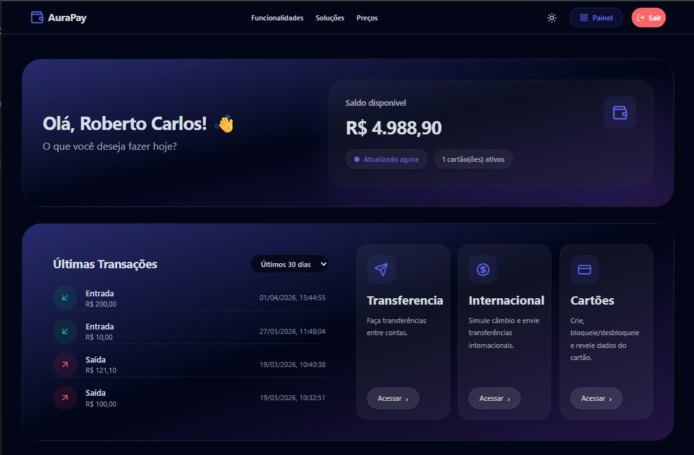

# 💳 AuraPay Frontend

Frontend da plataforma **AuraPay**, simulando a experiência de um banco digital moderno, com autenticação, dashboard protegido e operações financeiras integradas a um backend em .NET.

> Projeto focado em demonstrar construção de aplicações reais com arquitetura escalável, integração com API e experiência moderna de usuário.

---

## 📸 Preview

### 💻 Landing Page

<p align="center">
  
</p>

### 📱 Mobile

<p align="center">
  
</p>

### 📊 Dashboard

<p align="center">
  
</p>

---

## ✨ Principais Features

* Autenticação (login, cadastro e proteção de rotas)
* Dashboard com saldo, cartões e transações
* Transferências com histórico e filtros
* Remessas internacionais (simulação + envio)
* Cartões virtuais (criação, listagem e bloqueio)

---

## 🛠 Stack Tecnológica

* Next.js 16 (App Router)
* React 19 + TypeScript
* Tailwind CSS 4
* Axios (interceptors para JWT)
* Zustand (estado global)
* React Hook Form + Zod
* Framer Motion + Lucide

---

## 🧭 Arquitetura

Organização por feature:

```text
src/
  app/
    auth/
    dashboard/
  features/
    auth/
    accounts/
    transactions/
    international/
    cards/
  lib/
    api.ts
  store/
    authStore.ts
```

---

## ⚙️ Integração com API

* Backend .NET (AuraPay API)
* JWT automático via interceptor
* Tratamento global de erros
* Logout automático em `401`

---

## ▶️ Como Rodar

### Pré-requisitos

* Node.js >= 20
* Backend AuraPay rodando

### Instalar dependências

```bash
npm install
```

### Configurar ambiente

Crie `.env.local`:

```env
NEXT_PUBLIC_API_URL=https://localhost:7250/api
```

### Executar

```bash
npm run dev
```

Acesse: http://localhost:3000

---

## 🧪 Scripts

```bash
npm run dev
npm run build
npm run start
npm run lint
```

---

## ⚠️ Observações

* O backend deve estar rodando para a aplicação funcionar
* Ajuste a URL da API conforme sua porta local

---

## 🚀 Diferenciais

* Integração real com backend financeiro
* Estrutura escalável por domínio
* Gerenciamento de estado e sessão
* Tratamento robusto de erros
* UI moderna com foco em experiência

---

Projeto desenvolvido para demonstrar a construção de um frontend moderno, integrado e pronto para produção.
